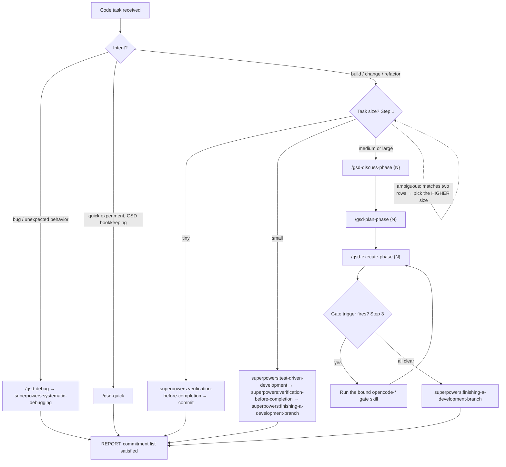

# agentic-apps-workflow

This is the trigger skill for the AgenticApps spec-first workflow on
the opencode host. It is a `full`-conformance implementation of
[`agenticapps-workflow-core`](https://github.com/agenticapps-eu/agenticapps-workflow-core)
v0.9.1. The frontmatter `implements_spec: 0.9.1` is the conformance
citation per spec/09.

The body of this skill follows the structure required by the core
spec: the four canonical-prose blocks (Step 0, Rationalization Table,
13 Red Flags, Pressure-Test Scenarios) appear verbatim; the
declarative-contract sections (Step 1 task sizing, Step 2 routing, Step
3 gate bindings, Step 4 ADR capture, Verification Check) are
host-specific to opencode.

---

## Step 0 — The Commitment Ritual (NON-NEGOTIABLE)

As the FIRST user-facing output of your turn, before any tool call or
clarifying question, you MUST emit a `## Workflow commitment` block:

```
## Workflow commitment

I am using the agentic-apps-workflow skill for this task.
Task scope: {{one-sentence description}}
Task size: {{tiny | small | medium | large}}

Skills I will invoke, in order:
1. {{skill-name}} — {{why it applies}}
2. {{skill-name}} — {{why it applies}}
...

Post-phase gates (if applicable): {{review | cso | qa}}
Verification evidence I will produce: {{list of artifacts}}

Once I have stated this plan, I am committed to it. Deviating without
explicit user approval is a protocol violation.
```

Skipping this ritual is itself a protocol violation. You cannot rationalize
your way out of it — see the rationalization table below.

---

## Step 1 — Pick task size

Match the user's request to the smallest size that fits, then use the
required-skills column as the minimum invocation list. Sizes scale up,
not down: a "tiny" misclassification of a "medium" task is a protocol
violation.

| Size | Heuristic | Required skills (in order) |
|---|---|---|
| **Tiny** | One-line typo, comment edit, README tweak, no behavior change | `superpowers:verification-before-completion` |
| **Small** | Single-file logic change, isolated bug fix, ≤ ~20 lines diff | `superpowers:test-driven-development` → `superpowers:verification-before-completion` → `superpowers:finishing-a-development-branch` |
| **Medium** | Multi-file feature, new endpoint, new component, new test class | `/gsd-discuss-phase` → `/gsd-plan-phase` → `/gsd-execute-phase` (auto-invokes the gate skills bound in Step 3) |
| **Large** | Cross-cutting refactor, new service, new data shape, new infrastructure | `/gsd-discuss-phase` → `/gsd-plan-phase` → `/gsd-execute-phase` plus `opencode-cso`, `opencode-database-sentinel-audit`, `opencode-impeccable-audit` per gate triggers in Step 3 |

If the request matches multiple rows, pick the higher one. The
commitment block in Step 0 names the chosen size — this commits you to
the row's invocation list.

---

## Step 2 — Route to the right entry point

opencode's invocation idiom is `$skill-name`. The five GSD entry-point
skills are explicit-only (`policy.allow_implicit_invocation: false` in
their `agents/openai.yaml`); invoke them by typing the `$` shortcut.

The Step 1 size decision and this Step 2 routing form one branchy
workflow. The flowchart below is the decision skeleton (per spec §12);
the tables that follow carry the criteria — when a task matches two
rows, judgment picks the higher one (the labeled fallback edge).



| User intent | Entry point |
|---|---|
| Tiny or small task | invoke gate skills directly per Step 1 — no GSD orchestration |
| Bug or unexpected behavior | `/gsd-debug` (auto-invokes `superpowers:systematic-debugging`) |
| Quick experiment with GSD bookkeeping | `/gsd-quick` |
| Surface open questions before planning | `/gsd-discuss-phase {N}` |
| Author a phase plan | `/gsd-plan-phase {N}` |
| Execute a planned phase | `/gsd-execute-phase {N}` |

`{N}` is the phase number from the project's `ROADMAP.md`.
`/gsd-execute-phase` (GSD, upstream) is the heavyweight orchestrator: it walks each plan
in the phase, fires the applicable gates from Step 3, and refuses to
mark any task complete without verification evidence (per spec/06).

---

## Step 3 — Gate-to-skill bindings

The 16 gates from
[spec/02-hook-taxonomy.md](https://github.com/agenticapps-eu/agenticapps-workflow-core/blob/main/spec/02-hook-taxonomy.md)
are bound on the opencode host as follows. This table is the host's
binding contract for `full` conformance per spec/09.

### Pre-phase

| Gate | Bound skill | Notes |
|---|---|---|
| `brainstorm-ui` | `superpowers:brainstorming` | Same skill covers UI and architecture; body branches on the prompt |
| `brainstorm-architecture` | `superpowers:brainstorming` | |
| `design-shotgun` | `opencode-design-shotgun` | Generates ≥3 visual variants and writes them into `CONTEXT.md` |
| `design-critique` | `opencode-design-critique` | Impeccable-style critique against an existing `UI-SPEC.md` |

### Pre-execution

| Gate | Bound skill | Notes |
|---|---|---|
| `plan-review` | **`/gsd-review`** — a slash **command** from upstream gsd-opencode (`commands/gsd/gsd-review.md`), not a skill: there is no `gsd-review` under `skills/`, so do not go looking for one | Fires once a phase has one or more `*-PLAN.md`, before the first code-touching execution edit. Evidence is `{phase}-REVIEWS.md` carrying independent review from **at least two external AI reviewers** — adversarial review of the plan before any code exists. Per spec §02 the gate resolves the active phase in this order: explicit phase pointer → workflow state (`current_phase`) → newest plan artifact by mtime → fail-open (allow); a single mutable pointer alone is non-conformant (core ADR-0025). It **grandfathers** already-executed phases: when a `*-SUMMARY.md` exists for the resolved phase the edit is allowed, so enabling the gate never retroactively blocks work shipped before it functioned. |

### Per-task / execution

| Gate | Bound skill | Notes |
|---|---|---|
| `tdd` | `superpowers:test-driven-development` | Produces a `test(RED):` + `feat(GREEN):` commit pair atomically |
| `tdd` (new TS module) | `opencode-ts-declare-first` | Strengthens `tdd` for a new TypeScript module's API surface (spec §13): three atomic commits `declare(ts):` → `test(ts):` (RED) → `feat(ts):` (GREEN); refuses to collapse declare + impl into one commit |
| `ui-preview` | `opencode-qa` (preview mode) | Per-task pre-commit screenshot mode of the same QA skill; the qa skill body branches on `mode=preview` vs `mode=phase-qa` |
| `verification` | `superpowers:verification-before-completion` | Refuses task completion when `must_have` evidence is missing |

### Post-phase

| Gate | Bound skill | Notes |
|---|---|---|
| `spec-review` | `opencode-spec-review` | Stage 1; writes `## Stage 1 — Spec compliance` into `REVIEW.md` |
| `code-review` | `superpowers:requesting-code-review` | Stage 2; spawns an independent reviewer via `opencode run --model …` per [ADR-0002](../../docs/decisions/0002-stage2-independent-reviewer-on-codex.md) |
| `security` | `opencode-cso` | OWASP-aligned security audit; writes `SECURITY.md`. Per spec §02 (v0.6.0) an LLM-scoped changeset MUST also record **§14 prompt-injection conformance evidence** for the affected surface — delegated to `injection-guard` (agenticapps-observability), same basis as §10. Cannot fire on this scaffolder (no LLM prompt-building path — see Spec deltas); bound for downstream projects |
| `database-security` | `opencode-database-sentinel-audit` | Same skill, "in-phase" mode |
| `qa` | `opencode-qa` | Phase-level browser-driven QA mode (distinct from `ui-preview` mode) |
| `impeccable-audit` | `opencode-impeccable-audit` | Visual quality audit per [ADR-0011](https://github.com/agenticapps-eu/agenticapps-workflow-core/blob/main/adrs/0011-impeccable-design-quality-gate.md) |
| `db-pre-launch-audit` | `opencode-database-sentinel-audit` | Same skill, "pre-launch" mode |

### Finishing

| Gate | Bound skill | Notes |
|---|---|---|
| `branch-close` | `superpowers:finishing-a-development-branch` | Composes the PR description from the phase artifacts |

The `superpowers:systematic-debugging` skill is not bound to a spec gate —
it is the implementation behind `/gsd-debug` for the four-phase
Observe → Hypothesize → Test → Conclude protocol.

A gate fires when its trigger condition (per spec/02) is met. The
trigger skill does not pre-fire gates whose conditions cannot be met
(e.g. `database-security` is not invoked on a phase that does not
touch DB code).

---

## Setup strategy — guarded snapshot (spec §08)

Setup installs a **prebuilt snapshot**, not a `0000`→latest migration
replay (ADR-0007). Spec §08 (v0.9.0) makes this a conformant strategy
**provided a drift guard proves the snapshot equals the chain's end
state**, and requires the host to name that guard here:

> **Guard: `migrations/check-snapshot-parity.sh`.** It runs in CI on
> every push (`.github/workflows/ci.yml`, step *Snapshot drift guard*)
> and fails the build when `snapshot/` and the migration chain's end
> state disagree.

The guard is the load-bearing half of the claim. A guarded snapshot is
not a second source of truth — it is a build artifact of the one in
`migrations/`, and the guard is what makes that checkable rather than
merely asserted. An **unguarded** snapshot is non-conformant. The
update flow is unaffected: it consumes the single `migrations/`
directory directly.

---

## Spec deltas (spec 0.9.1)

Per core spec §09, a host names every requirement it does not satisfy
verbatim, with rationale. Audited 2026-07-15.

- **§14 prompt-injection — trivially conformant.** This scaffolder
  builds no LLM prompts from non-self-authored values, so §14's trigger
  condition cannot occur; §09 requires only that the host say so. The
  skills this repo ships are prose the agent reads, not prompts
  assembled from untrusted input. Downstream projects that *do* build
  prompts get §14 coverage via the `injection-guard` skill
  (agenticapps-observability, `implements_spec: 0.6.0`), on the same
  delegation basis as §10 — see [ADR-0005](../../docs/decisions/0005-adopt-observability-architecture.md).
- **Eight spec/02 gates whose trigger cannot occur here** (`brainstorm-ui`,
  `design-shotgun`, `design-critique`, `ui-preview`, `qa`,
  `impeccable-audit`, `database-security`, `db-pre-launch-audit`) are
  bound for downstream projects but never fire on this UI-less,
  DB-less scaffolder. Enumerated with rationale in
  [docs/ENFORCEMENT-PLAN.md](../../docs/ENFORCEMENT-PLAN.md#spec-deltas--gates-whose-trigger-cannot-occur).
  Per spec/09 an omission whose trigger cannot occur does not downgrade
  `full` to `partial`.
- **§10 observability — satisfied by delegation**, not omitted: the
  generator obligation is met by the standalone
  `agenticapps-observability` skill consumed via its opencode install
  surface. A satisfied MUST per §09, not a delta — recorded here only
  because readers look for it. See
  [docs/observability-delegation.md](../../docs/observability-delegation.md).

---

## Step 4 — Record the decision

Every non-trivial decision lands as an ADR in
`docs/decisions/NNNN-{slug}.md`. Use the existing ADRs in
[`docs/decisions/`](../../docs/decisions/) as the shape reference (see
[ADR-0001](../../docs/decisions/0001-opencode-skill-naming.md) for the
canonical layout). Generic and database-acceptance ADR templates from
`agenticapps-workflow-core/templates/` are deferred — copy from
`docs/decisions/0001-*.md` until the core templates land.

ADR-0012 governs the database-sentinel acceptance template. When that
gate fires, copy its ADR shape from
[`agenticapps-workflow-core/adrs/0012-database-sentinel-rls-audit-gate.md`](https://github.com/agenticapps-eu/agenticapps-workflow-core/blob/main/adrs/0012-database-sentinel-rls-audit-gate.md)
into `docs/decisions/` as a new numbered entry.

---

## Rationalization Table — Check Before Skipping Anything

| If you think... | The reality is... |
|---|---|
| "This task is too small for the commitment ritual" | The ritual takes 15 seconds. Skipping it is how discipline erodes. Emit the block. |
| "Skill is obvious, no need to announce it" | The announcement IS the commitment. Announcement → consistency pressure → compliance. |
| "TDD is impractical for frontend" | Snapshot tests, `/browse` screenshot diffs, visual regression count as TDD. Write the test first. |
| "I've already thought about alternatives" | If you didn't write them down, you didn't consider them. List ≥2 in RESEARCH.md. |
| "Two-stage review is excessive" | Stage 1 catches spec drift, Stage 2 catches code-quality drift. Different failures, different agents. |
| "Dev server isn't worth booting for this change" | If you touched JSX/TSX, boot it. 30 seconds. |
| "The user explicitly said ship fast" | Acknowledge urgency, explain risk in one sentence, offer minimum discipline that protects the critical path. |

---

## 13 Red Flags — STOP → DELETE → RESTART

1. Code written before the test (for TDD tasks)
2. Test added after implementation
3. Test passes on first run — no RED observed
4. Cannot explain why the test should have failed
5. Tests marked for "later" addition
6. "Just this once" reasoning
7. Manual testing claimed as verification evidence
8. Two-stage review collapsed into one
9. Framing discipline as "ritual" or "ceremony"
10. Keeping pre-written code as "reference" while writing tests
11. Sunk-cost reasoning about deleting unverified code
12. Describing discipline as "dogmatic"
13. "This case is different because..."

---

## Pressure-Test Scenarios — Self-Check

Before you skip any step, ask yourself:
- Would I skip this step if this code were running in production serving real users?
- Would a senior engineer reviewing this work accept the shortcut?
- Am I rationalizing? Check the rationalization table above.

If any answer gives you pause, follow the protocol.

---

## Verification Check (host-specific)

Before claiming any phase complete, run the following checks against
the working tree. Each check is a permitted evidence shape per
spec/06.

### Phase artifacts are committed (not gitignored)

Phase evidence lives under `.planning/phases/` and MUST be tracked by
git. A host project — often one scaffolded by another tool, or
carrying a template `.gitignore` — that ignores `.planning/phases/`
silently breaks every downstream check below: the grep/awk probes
scan files that never reach the branch. Probe before committing
evidence:

```bash
git check-ignore .planning/phases/ \
  && echo "BLOCKED: .planning/phases/ is gitignored" \
  || echo "ok: .planning/phases/ is tracked"
```

If the host project gitignores `.planning/phases/`, un-ignore it in a
dedicated chore commit **before** committing phase evidence, and flag
it in RUN-NOTES/handoff. (Workflow-testbed round-2 benchmark feedback:
the opencode run handled this friction correctly by un-ignoring the
path in a dedicated chore commit; this check promotes that from
improvisation to documented behavior.)

### Commitment block was emitted

The session transcript or `.planning/phases/<NN>-<slug>/SUMMARY.md` contains
the `## Workflow commitment` block. If the agent did not emit it, the
phase is non-conformant and Stage 1 review MUST flag it.

```bash
grep -l '^## Workflow commitment$' .planning/phases/*/SUMMARY.md 2>/dev/null \
  || echo "MISS: commitment block not found in any phase summary"
```

### TDD commit pairs exist for tasks marked `tdd="true"`

For each plan with `tdd="true"`, the git history MUST contain a
`test(RED):` commit followed by a `feat(GREEN):` commit (or host
equivalent prefixes per spec/02 `tdd` gate).

```bash
git log --oneline --grep '^test(RED)' | head
git log --oneline --grep '^feat(GREEN)' | head
# Both lists are expected to be non-empty for any phase containing a
# TDD-flagged plan; pair them by chronological adjacency.
```

### Stage 2 evidence is present and independent

`REVIEW.md` for the phase contains both `## Stage 1 — Spec compliance`
and `## Stage 2 — Code quality`. Stage 2 was authored by an
independent reviewer (per spec/07) — on opencode this means a `codex
exec` child invocation logged in the phase's `evidence/` directory or
referenced by command in `REVIEW.md`.

```bash
grep -l '^## Stage 1 — Spec compliance' .planning/phases/<NN>-<slug>/REVIEW.md \
  && grep -l '^## Stage 2 — Code quality' .planning/phases/<NN>-<slug>/REVIEW.md \
  || echo "MISS: REVIEW.md is missing one of the two stages"
```

### Per-`must_have` evidence in VERIFICATION.md

Every `must_have` row in `VERIFICATION.md` has at least one Evidence
subrow per spec/06. A `must_have` with zero Evidence rows is a
verification failure.

```bash
awk '
  /^### must_have:/ { must=$0; ev=0; next }
  /^- Evidence:/ && must { ev++ ; next }
  /^### / && must && !ev { print "MISS evidence: " must; must=""; ev=0 }
  END { if (must && !ev) print "MISS evidence: " must }
' .planning/phases/<NN>-<slug>/VERIFICATION.md
```

### `implements_spec` is current

The trigger skill's frontmatter MUST cite the spec version this
project's contract is asserted against. If the project bumps to a
newer core version, update the trigger skill's frontmatter and
re-validate.

```bash
grep '^implements_spec:' "${OPENCODE_CONFIG_DIR:-$HOME/.config/opencode}/skills/agentic-apps-workflow/SKILL.md"
```

---

## Where this skill lives at runtime

After install via this scaffolder's `install.sh` (or by symlinking the
`skills/agentic-apps-workflow/` directory into `$OPENCODE_CONFIG_DIR/skills/`),
opencode auto-discovers this SKILL.md and routes to it on any code task
matching the description in the frontmatter.

The skill stays loaded only during the triggering turn (per opencode's
progressive-disclosure design); subsequent turns re-trigger when the
description matches.

---

## Knowledge Capture — Ritual Tail (spec §15)

Transferable learnings must not die in a `.opencode/session-handoff.md` that
the next session overwrites. This step routes them to a cross-repo memory:
**one Obsidian note per repo** in the operator's vault. It is the FINAL step of
three rituals — run it AFTER, never before, the ritual's own artifact exists:

1. **Session handoff** — after `.opencode/session-handoff.md` is written.
2. **Plan completion** — after a phase plan is authored/marked complete under
   `.planning/` (`/gsd-plan-phase`).
3. **Phase completion** — after the phase artifacts are committed
   (`/gsd-execute-phase`).

The vault write is machine-local: it MUST NEVER be committed to the repo, and
it MUST NEVER fail, block, or roll back the ritual that triggered it — on any
failure print one warning line and continue. This mirrors the same section in
the project `AGENTS.md` (root-down concat); both are the same contract, so a
session that only reads `AGENTS.md` still performs the capture.

Procedure (mechanical — follow every branch exactly):

1. **Read the config.** Open `.planning/config.json` — the single, shared,
   host-neutral file (opencode does not namespace it) — and read its
   `knowledge_capture` object. **Skip** — print at most one line
   `knowledge-capture: skipped (<reason>)` and continue the ritual — when ANY
   of these holds:
   - `.planning/config.json` is absent, or has no `knowledge_capture` key, or
   - `knowledge_capture.enabled` is `false`, or
   - the parent folder of `knowledge_capture.note` does not exist (expand a
     leading `~` against `$HOME` first).
   NEVER create the parent folder: an absent vault means "not this machine",
   not "set up the vault".
2. **Distill 1–5 transferable learnings** from the ritual just completed. A
   learning qualifies ONLY if it would change how you, another agent, or
   another host works next time: gotchas whose root cause generalizes; decision
   rationale with reusable trade-offs; tooling/workflow insights (what made the
   agent fast or slow); wrong assumptions and what corrected them. Status
   updates, restatements of the plan, repo facts already in
   ADRs/handoffs/CHANGELOGs, and filler do NOT qualify. **If nothing clears the
   bar, write nothing** — no empty entries, no placeholders. A skipped write is
   conformant; a padded one is not.
3. **Resolve the note path.** Let `NOTE` = `knowledge_capture.note` with a
   leading `~` expanded against `$HOME`.
4. **Create the note on first write.** If `NOTE` does not exist, create it from
   the skeleton at
   `${OPENCODE_CONFIG_DIR:-$HOME/.config/opencode}/skills/setup-opencode-agenticapps-workflow/templates/obsidian-learnings-note.md`
   (fill the `<...>` fields and the dates; `hosts:` starts as `[opencode]`).
5. **Prepend a Log entry** at the TOP of `## Log` (append-only — NEVER edit or
   delete existing entries) under a heading of EXACTLY this shape, with
   `opencode` as the host tag:
   `### YYYY-MM-DD — <handoff|plan|phase> — <short title> (opencode)`
   where the second field is the trigger that fired (`handoff`, `plan`, or
   `phase`), and the learnings as bullets beneath it.
6. **Curate `## Key Learnings`:** dedupe, merge related items, promote log
   entries that earned it, demote or remove stale ones. Target ~10–20
   highest-value items — each a bolded short title plus one to three sentences
   carrying the transferable insight, not the status.
7. **Update frontmatter:** set `updated:` to today's date; ensure `opencode`
   appears in the `hosts:` list (add it, preserving any hosts already listed —
   e.g. `[claude]` becomes `[claude, opencode]`).
8. **Report** in one or two lines what was written (or why the step skipped).

Vault safety (hard rules): touch ONLY the configured note — never other repos'
notes, the folder's `CLAUDE.md`, or anything else in the vault. Never write
secrets, tokens, URLs with embedded credentials, or client-confidential data;
redact before writing.

The destination is config-routed (spec §15.2) and the block is host-neutral, so
a codex or claude host running in the same working tree reads the **same**
`.planning/config.json → knowledge_capture` and writes to the same per-repo
note (differentiated only by the `(opencode)` / `(codex)` / `(claude)` host tag
in the Log heading). See [ADR-0008](../../docs/decisions/0008-knowledge-capture.md)
and core [ADR-0017](https://github.com/agenticapps-eu/agenticapps-workflow-core/blob/main/adrs/0017-knowledge-capture-obsidian.md).
