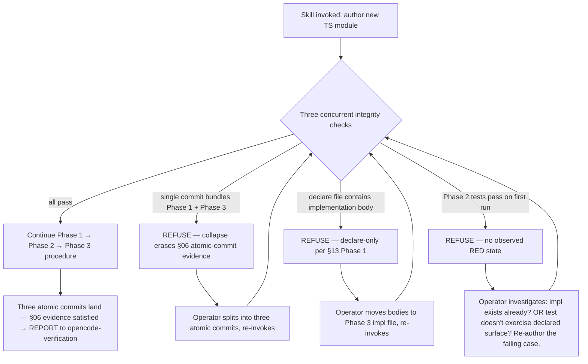

# opencode-ts-declare-first — declare-first TypeScript discipline (spec §13)

This skill implements the declare-first TypeScript discipline from
`agenticapps-workflow-core` spec §13 on the opencode host. When
an operator authors a new TypeScript module's public API surface, this
skill guides the model through three atomic commits that pin the
contract before any implementation exists.

It is the opencode-host equivalent of claude-workflow's `ts-declare-first`
skill. §13 names `opencode-workflow` explicitly as a TS-targeting host that
SHOULD ship this skill (core CHANGELOG, 0.4.0 entry).

The discipline is a strengthening of TDD: in ordinary TDD the test names
the behaviour and the implementation's signature emerges. In
declare-first, the signature is fixed up front in a `declare`-only file;
the test exercises *signature + behaviour*; the implementation has no
room to diverge from the declared surface without breaking type-check.
This is why the frontmatter carries `implements_gate: tdd` — the skill
strengthens the `tdd` gate (spec/02) for TypeScript modules rather than
defining a new gate.

## Trigger

Two forms per §13:

- **Explicit** (this skill's current trigger): operator invokes
  `$opencode-ts-declare-first` when starting a new TS module. E.g.:

  > "I'm starting a new TS module `lib/bounded-queue/`. Use
  > $opencode-ts-declare-first."

- **Implicit** (future wiring): `$gsd-plan-phase` / `$gsd-execute-phase`
  recognise that a phase plan introduces a new TS module AND the
  project's `package.json` declares TypeScript as the primary language,
  then route the task through this skill. The per-project binding lives
  in `.planning/config.json` (`hooks.per_task.tdd.strengthened_by`,
  seeded by migration 0002); the GSD-side detection that fires on it is
  a follow-up.

## Procedure

Follow these three phases in order. Each phase ends with an atomic
commit. **The skill REFUSES to bundle phases** (see Refusals).

### Phase 1 — Declaration surface

Produce a `declare`-only TypeScript file at the module's path with the
`.declare.ts` extension. The file's content is strictly:

- `declare class`, `declare function`, `declare const`, `declare let`,
  `declare var` statements; and/or
- `interface` and `type` definitions; and/or
- `export` re-exports of the above.

The file MUST NOT contain:

- Function bodies, class method bodies, or expression initialisers for
  `declare const`.
- Any other executable TypeScript code.

JSDoc on declared symbols is encouraged (`@throws`, `@deprecated`,
parameter constraints, behavioural notes). JSDoc is not implementation.

Verify before committing Phase 1:

```bash
# The declare-only file MUST type-check clean on its own.
npx tsc --noEmit --strict path/to/<module>.declare.ts
```

Commit shape:

```text
declare(ts): <module> — Phase 1 surface contract (declare-only)
```

### Phase 2 — Failing tests against the declared surface

Produce test files that import and exercise the declared surface. The
test file MUST:

- Include at least one test per declared symbol (type-only symbols may
  be exercised via a value-level symbol that consumes them).
- Cover happy-path, error-path, and edge-case behaviour per the host's
  existing test rules.
- Be observable as failing in the expected way at this commit:
  type-check succeeds (the symbols exist as declarations), but the test
  runner reports the expected failure (implementations do not yet
  exist).

Resolution mechanism — pick one of:

1. **Path alias.** Add a `tsconfig.json` `paths` entry mapping
   `./<module>` to `./<module>.declare` so the test's
   `import { X } from './<module>'` resolves to the declare file. Remove
   the alias at Phase 3 when the impl exists.
2. **Stub impl.** Write `<module>.ts` containing only
   `export * from './<module>.declare'` at Phase 1. The test's `import`
   resolves through the stub. At Phase 3, replace the stub with the real
   impl.
3. **Direct import.** Test imports from `./<module>.declare` directly
   during Phase 2; switch to `./<module>` at Phase 3. Simplest, but the
   test file changes between Phase 2 and Phase 3, which dilutes the
   contract-test purity.

Capture the failing-test output as §06 evidence (this is the
`opencode-verification` evidence shape `test_output`):

```bash
npm test -- path/to/<module>.test.ts > /tmp/phase-2-expected-failure.log
# An UNEXPECTED failure (e.g. a type error) means the declarations are
# wrong — fix Phase 1's file BEFORE proceeding to Phase 3.
```

Commit shape:

```text
test(ts): <module> — Phase 2 contract tests (RED, expected-fail)
```

### Phase 3 — Implementation

Produce `<module>.ts` (or replace the stub from Phase 2 option #2) with
the actual implementation. The implementation MUST:

- Export signatures that match the declared signatures exactly.
  Widening, narrowing, or renaming a signature relative to the
  declaration is allowed only via an ADR explaining the deviation.
- Make all Phase-2 tests pass.

After commit:

```bash
npm test -- path/to/<module>.test.ts   # expect: all tests pass
```

Commit shape:

```text
feat(ts): <module> — Phase 3 implementation (GREEN)
```

Preservation of the declaration file (§13 SHOULD): pick one of:

- **Keep `<module>.declare.ts` as the public type surface** and
  re-export from it — the implementation file is non-public.
- **Delete `<module>.declare.ts`** once `tsc` emits a `.d.ts` from the
  implementation; record the transition in the Phase-3 commit message.

The host MAY pick either option per module; mixed strategies within a
repo are permitted.

## Refusals

The skill checks three integrity conditions whenever it is invoked. Any
triggering refusal routes the operator back to the relevant phase with a
recovery instruction; the skill re-checks on the next invocation. The
diagram is the decision skeleton; the prose below it carries the
recovery instructions and the *why* of each refusal.



Recovery details per refusal:

- **Collapsed-commits refusal.** The atomic three-commit shape is the
  §06 structural evidence the declare-first discipline was followed;
  collapsing it erases the evidence even if the resulting code is
  correct. Operator splits the work into three commits matching the
  Phase 1 / 2 / 3 shape above and re-invokes the skill.

- **Implementation-in-declare-file refusal.** §13 Phase 1 MUST NOT
  contain executable code. Function bodies, class method bodies, and
  expression initialisers for `declare const` all violate the contract.
  Operator moves the offending code into the Phase 3 impl file and
  re-invokes.

- **No-observed-RED refusal.** §13 Phase 2 MUST be observable as failing
  in the expected way at the moment of authoring. Tests passing on first
  run means either the impl was written before the test (a TDD-
  discipline violation that erases the contract evidence) OR the test
  does not actually exercise the declared surface (it passes for
  unrelated reasons, so the contract isn't being tested). Either case
  requires investigation and re-authoring — the skill cannot distinguish
  them, only the operator can.

## Verification-gate integration

Per §13 the three phases produce the §02 `verification`-gate evidence
that `opencode-verification` checks before a task completes:

| Phase | Evidence (`opencode-verification` shape) |
|---|---|
| 1 | `declare(ts):` commit hash; `tsc --noEmit` clean output |
| 2 | `test(ts):` commit hash; captured expected-failure runner output (`test_output`) |
| 3 | `feat(ts):` commit hash; passing runner output (`test_output`) |

`opencode-verification` MUST refuse task completion if the three-commit
sequence and its evidence are not present for a task that went through
this skill.

## Templates

Non-normative starter files in `./templates/` (three SEPARATE files so
the three-commit shape is structurally enforced on copy):

- `example.declare.ts` — bounded-queue declaration (Phase 1 shape).
- `example.test.ts` — bounded-queue contract tests (Phase 2 shape).
- `example.impl.ts` — bounded-queue implementation (Phase 3 shape).

Templates are starting points, not normative — operators adapt them to
the module they're authoring.

## References

- workflow-core spec §13 — declarative contract this skill implements.
- workflow-core spec §06 — Evidence Rules — the verification-before-
  completion contract Phase-2 expected-failure output satisfies.
- workflow-core spec §02 — Hook Taxonomy — the `tdd` gate this skill
  strengthens for TypeScript modules.
- migration 0002 (this repo) — binds this skill into project
  `.planning/config.json` per the §13 trigger contract.
